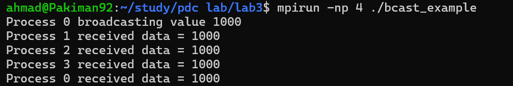
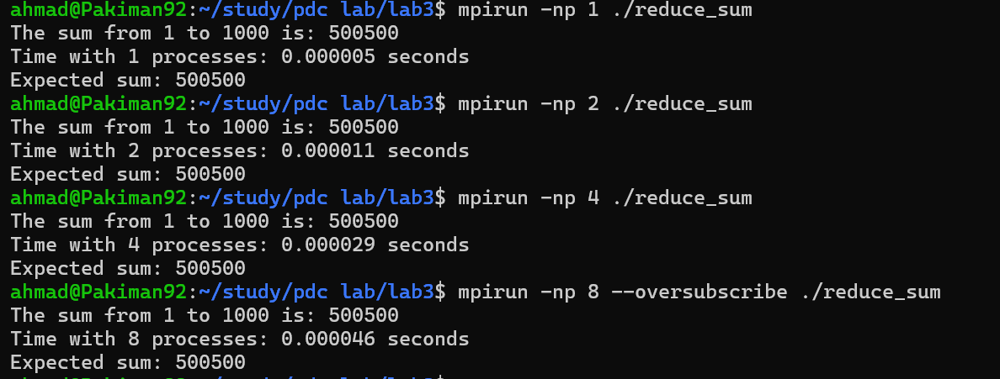
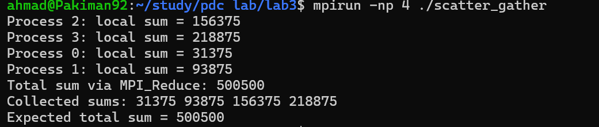
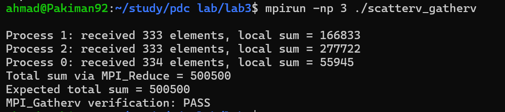
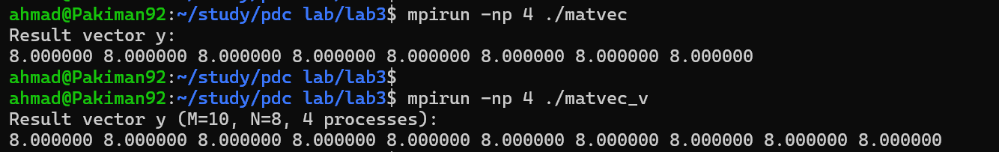

# Lab 3: MPI Collective Communication

> **Parallel & Distributed Computing — Semester 6**

## Overview

This lab explores **collective communication operations in MPI**, which allow a group of processes to communicate efficiently using coordinated operations. Unlike point-to-point communication, collective operations simplify data distribution and aggregation across multiple processes.

The lab demonstrates how MPI provides optimized primitives for broadcasting data, reducing values, scattering data among processes, gathering results, and handling uneven workloads.

## Prerequisites

- GCC compiler
- OpenMPI (`mpicc`, `mpirun`)

```bash
# Ubuntu/Debian
sudo apt install openmpi-bin libopenmpi-dev

# Arch
sudo pacman -S openmpi
```

## Build & Run

Compile any program with `mpicc` and run with `mpirun`:

```bash
cd src

# Compile
mpicc -o bcast_example bcast_example.c

# Run with N processes
mpirun -np 4 ./bcast_example
```

## Programs

| # | File | Description |
|---|------|-------------|
| 1 | [`bcast_example.c`](src/bcast_example.c) | MPI Broadcast — root process broadcasts a value to all other processes using `MPI_Bcast` |
| 2 | [`reduce_sum.c`](src/reduce_sum.c) | MPI Reduce — computes the sum of numbers from 1 to 1000 in parallel using `MPI_Reduce` |
| 3 | [`scatter_gather.c`](src/scatter_gather.c) | MPI Scatter & Gather — distributes array portions with `MPI_Scatter` and collects results with `MPI_Gather` |
| 4 | [`scatterv_gatherv.c`](src/scatterv_gatherv.c) | MPI Scatterv & Gatherv — handles uneven data distribution using `MPI_Scatterv` and `MPI_Gatherv` |
| 5 | [`matvec.c`](src/matvec.c) | Parallel matrix-vector multiplication using MPI collective operations |

## Screenshots

| Exercise 1 | Exercise 2 | Exercise 3 | Exercise 4 | Exercise 5 |
|:---:|:---:|:---:|:---:|:---:|
|  |  |  |  |  |

## Key Concepts Demonstrated

- **MPI Collective Communication** — coordinated operations across all processes in a communicator
- **Broadcast (`MPI_Bcast`)** — one-to-all data distribution from a root process
- **Reduction (`MPI_Reduce`)** — aggregating partial results (e.g., sum) into a single value
- **Scatter (`MPI_Scatter`)** — distributing equal-sized chunks of data to all processes
- **Scatterv (`MPI_Scatterv`)** — distributing uneven chunks of data to processes
- **Gather (`MPI_Gather`) / Gatherv (`MPI_Gatherv`)** — collecting results back at the root process
- **Parallel matrix-vector computation** — real-world application of collective operations

## Key Takeaways

- Collective operations simplify code compared to equivalent point-to-point implementations
- `MPI_Bcast` eliminates the need for manual send/recv loops for data distribution
- `MPI_Reduce` provides efficient parallel aggregation with built-in operations (sum, max, min, etc.)
- `MPI_Scatterv` / `MPI_Gatherv` handle cases where data cannot be evenly divided among processes
- Matrix-vector multiplication demonstrates practical use of scatter/gather for parallel linear algebra

## Project Structure

```
Lab 3/
├── README.md
├── docs/
│   ├── main.tex                 # LaTeX report source
│   └── 2023-CS-53.pdf          # Lab report
├── screenshots/
│   ├── Exercise1.png
│   ├── Exercise2.png
│   ├── Exercise3.png
│   ├── Exercise4.png
│   └── Exercise5.png
└── src/
    ├── bcast_example.c          # MPI Broadcast
    ├── reduce_sum.c             # MPI Reduce (parallel sum)
    ├── scatter_gather.c         # MPI Scatter & Gather
    ├── scatterv_gatherv.c       # MPI Scatterv & Gatherv
    └── matvec.c                 # Matrix-vector multiplication
```
